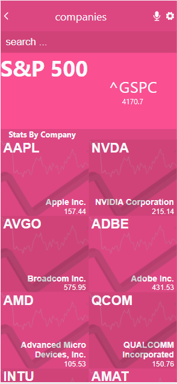

# stocks-app

## Description

stocks-app is an app that shows various company stock prices and more information about the companies. It is built using React and Redux

## Video Description
[link](https://www.loom.com/share/25dedb08b3c348b68fdb56fbc184c519)

## Built With

- React
- Redux

## Getting Started

To get the content of this project locally you need to run this command in your terminal:

- git clone your https://github.com/matovu-farid/stocks-app.git
- cd project stocks-app
- npm install
- npm start

## Authors

👤 **Matovu Farid Nkoba**

- GitHub: [@matovu-farid](https://github.com/matovu-farid)
- Twitter: [@matovu100](https://twitter.com/matovu100)
- LinkedIn: [matovu-farid](https://www.linkedin.com/in/matovu-farid-48b80257)

Original design idea by [Nelson Sakwa on Behance.](https://www.behance.net/sakwadesignstudio)

## 📝 License

This project is [MIT](./MIT.md) licensed.
